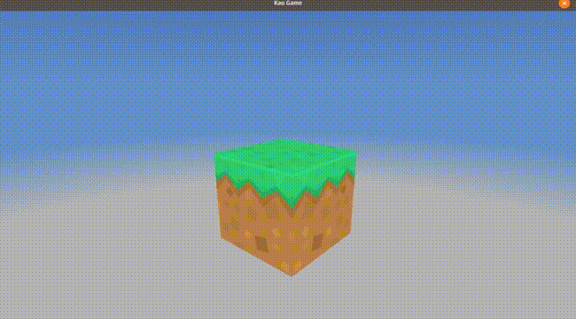

# Kau Rock

Kau rock is a tool to experiment with OpenGL, OpenTK and .net core on linux.

## Project Goals
### Primary Goal	
- Expand my skills with OpenGL
- Get used to a linux development environment.

### Secondary Goals
- Get a better understanding of the inner workings of game engines.
- Learn and implement multi-platform support (windows and android).
- Experience the freedoms and hardships of using my own custom engine.
- Learn Shaders in more detail.
- Experiment with 'voxel' based physics scenes.